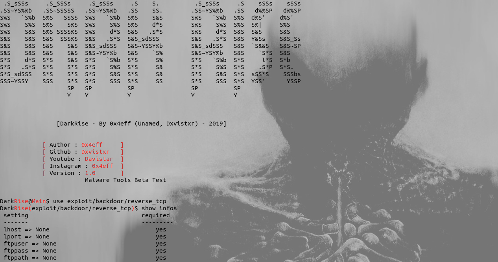
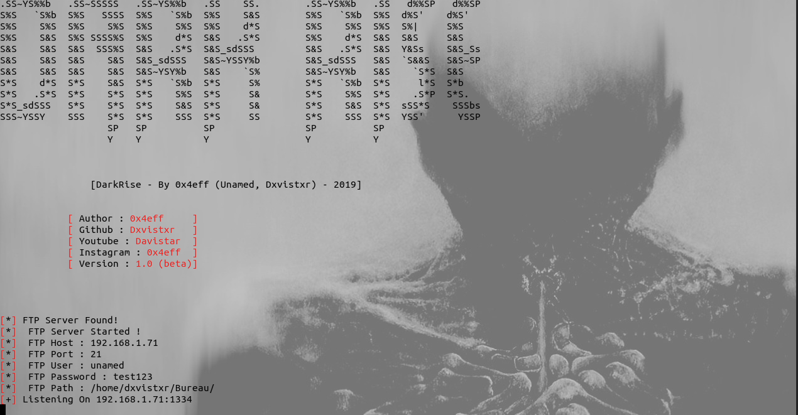

## DarkRise
### DarkRise Malware Framework Tools
### Version : 1.0
### Content : Backdoor, Keylogger, Reverse Shell with Python2.7
### Coming Soon : Ransomware, Other Malware, Spyware

## Installation :

### Required :
#### *Linux System

#### for Ubuntu/Debian/Kali Other Distro on debian
sudo apt update && sudo apt install python2 python python2-dev python-dev python-pip python-opencv python-crypto wine-stable wine wine-python-2.7 git

#### cd DarkRise && python2 -m pip install -r modules_linux.txt && wine python -m pip install -r modules_windows.txt && git clone https://github.com/Dxvistxr/pyinstaller

### if you have error with pyinstaller on wine install this => https://www.microsoft.com/en-us/download/details.aspx?id=44266
